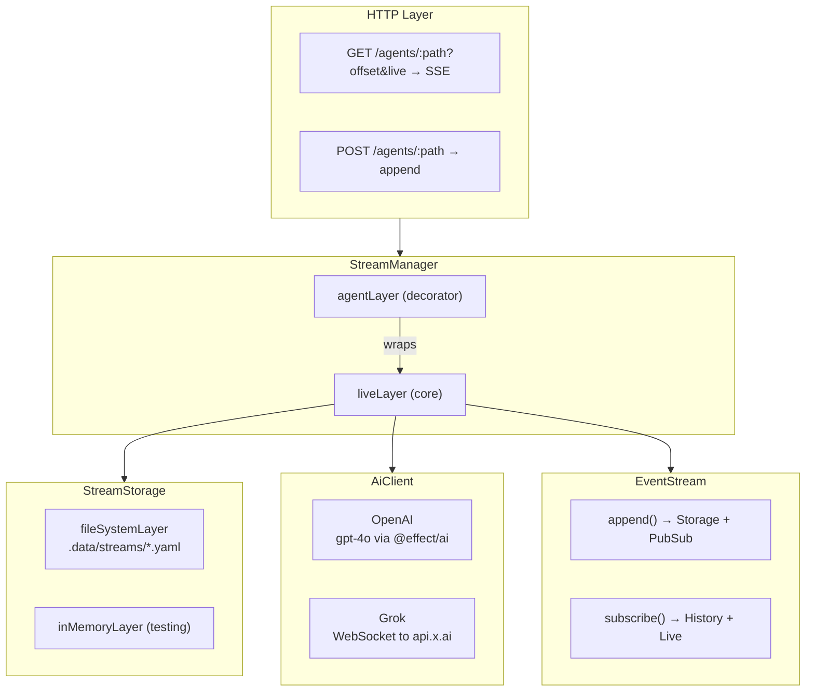
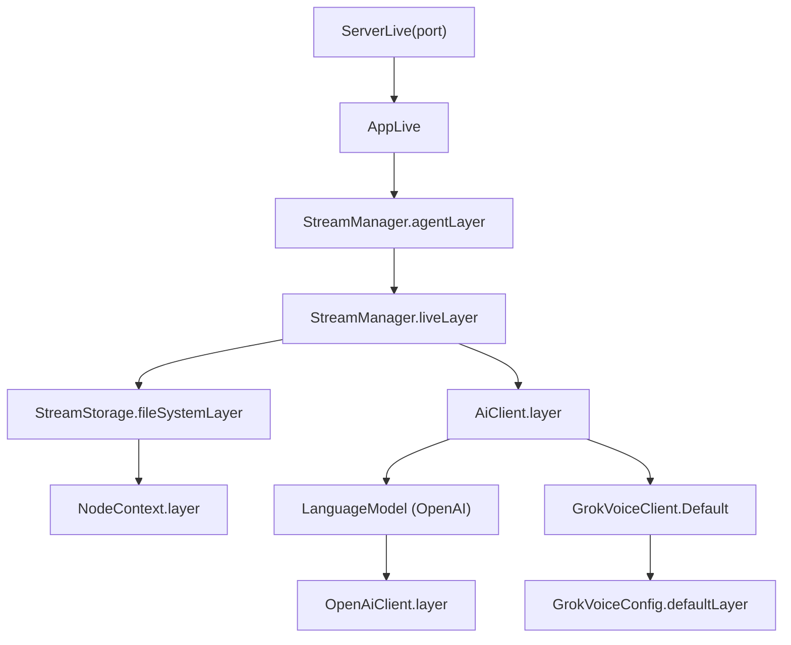
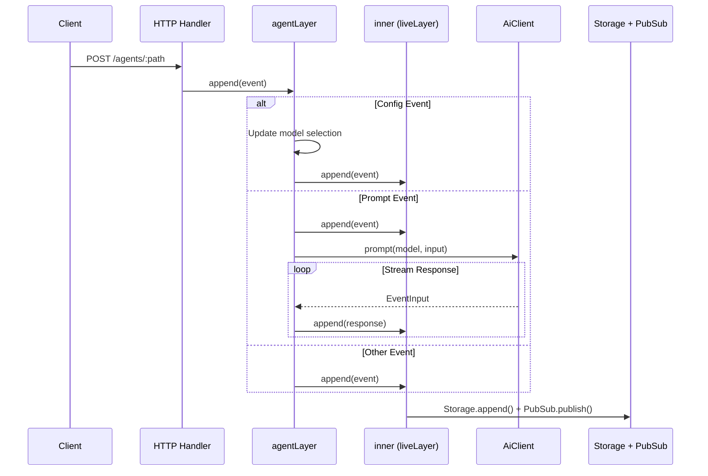
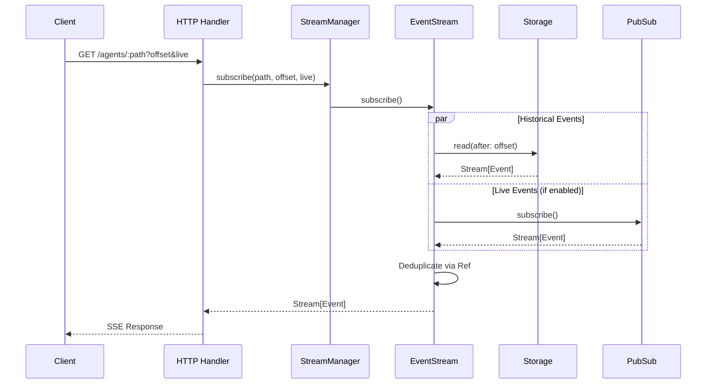

# durable-stream

Effect-native event streaming infrastructure with AI integration.

## Architecture



## Layer Composition



## Data Flow: Append (POST)



## Data Flow: Subscribe (GET)



## Domain Types

| Type         | Description                                                            |
| ------------ | ---------------------------------------------------------------------- |
| `StreamPath` | Branded string, e.g. `"agent/session-123"`                             |
| `Offset`     | Branded string, zero-padded numeric for ordering                       |
| `EventType`  | Branded string, e.g. `"iterate:agent:action:send-user-message:called"` |
| `EventInput` | `{ type, payload, version? }` - what clients send                      |
| `Event`      | EventInput + `{ offset, createdAt }` - what storage returns            |

## Key Event Types

| Event Type                                      | Trigger                                               |
| ----------------------------------------------- | ----------------------------------------------------- |
| `iterate:agent:config:set`                      | Switch AI model (`payload.model: "openai" \| "grok"`) |
| `iterate:agent:action:send-user-message:called` | User message, triggers AI                             |
| `iterate:openai:response:sse`                   | OpenAI streaming response chunk                       |
| `iterate:grok:response:sse`                     | Grok streaming response event                         |

## Storage Format

Events stored as YAML documents in `.data/streams/{path}.yaml`:

```yaml
type: "iterate:agent:action:send-user-message:called"
payload:
  content: "Hello"
offset: "0000000000000001"
createdAt: "2026-01-20T12:00:00.000Z"
version: "1"
---
type: "iterate:openai:response:sse"
payload:
  part: "Hi there!"
offset: "0000000000000002"
createdAt: "2026-01-20T12:00:00.100Z"
version: "1"
```

Offset counter tracked separately in `.data/streams/{path}.yaml.offset`.

## Service Patterns

Services follow the Effect Context.Tag pattern:

```typescript
// Definition
export class StreamManager extends Context.Tag("@app/StreamManager")<
  StreamManager,
  {
    readonly subscribe: (input: {...}) => Stream.Stream<Event, Error>;
    readonly append: (input: {...}) => Effect.Effect<void, Error>;
  }
>() {}

// Layer
export const liveLayer = Layer.effect(StreamManager, make);

// Usage
const manager = yield* StreamManager;
yield* manager.append({ path, event });
```
